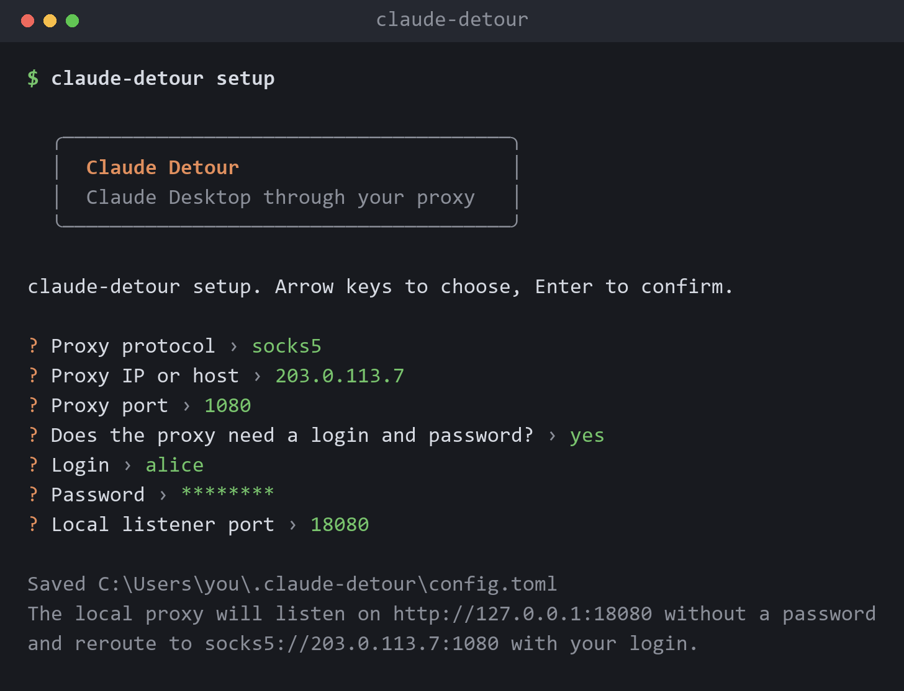
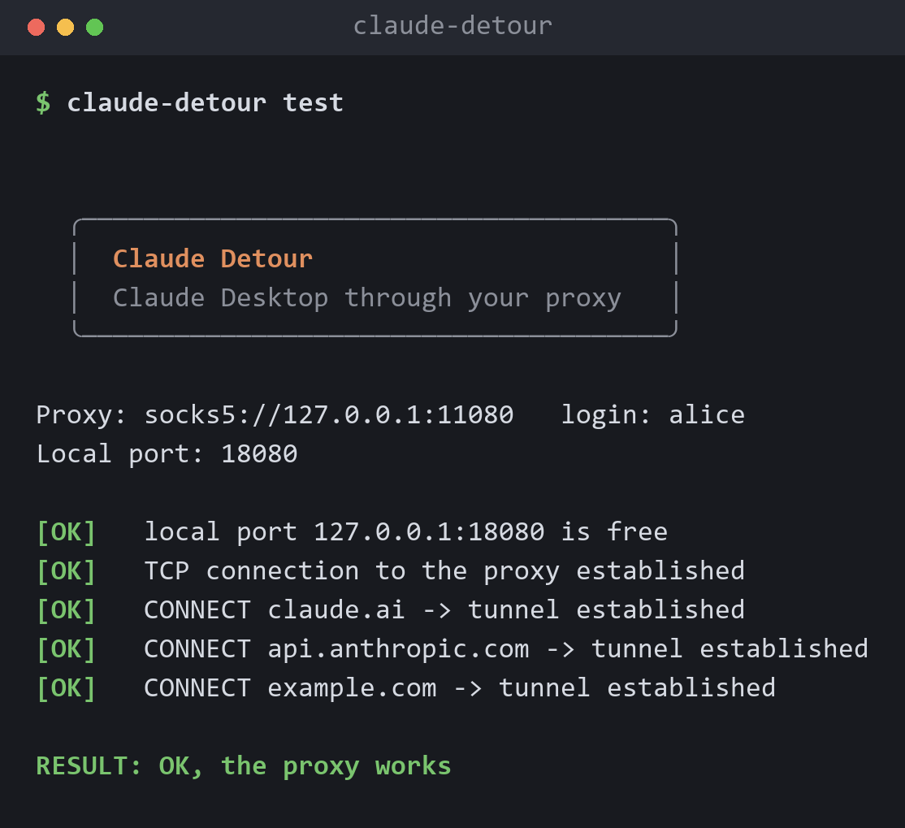
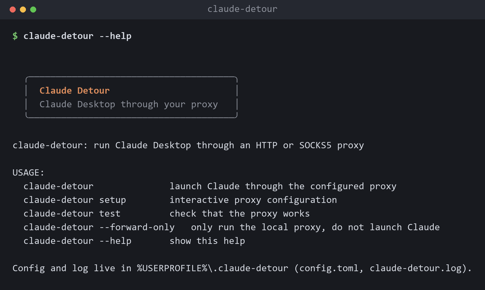
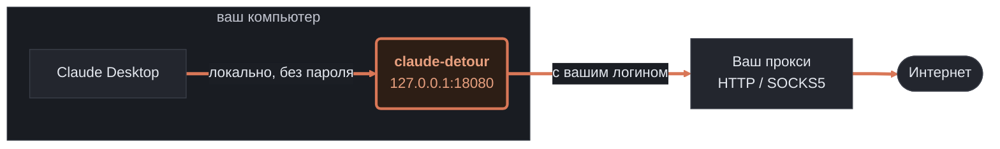

<div align="center">


# Claude Detour

Запускает Claude Desktop через ваш прокси (HTTP или SOCKS5). Без возни, одной кнопкой.

[](https://github.com/xpepelok/claude-detour/actions/workflows/ci.yml)

</div>

## Зачем это

Claude Desktop сам по себе не умеет ходить через прокси с логином и паролем. Приходится либо
поднимать что-то отдельное, либо лезть в системные настройки. Claude Detour делает это за вас:
поднимает у себя маленькую локальную проксю без пароля, заворачивает весь трафик Claude на ваш
прокси (и сам подставляет туда логин с паролем), а потом запускает Claude уже через неё.

## Установка

Скачайте `claude-detour.exe` со страницы [Releases](https://github.com/xpepelok/claude-detour/releases).

## Настройка

Запустите мастер настройки. Протокол выбираете стрелками, остальное вводите с клавиатуры:

```bash
claude-detour setup
```

<div align="center">

</div>

По шагам спросит:

- **протокол**: `http` или `socks5` (стрелки вверх, вниз, затем Enter);
- **IP или хост** и **порт** вашего прокси;
- **логин и пароль**: если они не нужны, просто пропускаете, тогда прокси используется без авторизации;
- **локальный порт**: можно оставить `18080` по умолчанию.

Всё сохраняется в `%USERPROFILE%\.claude-detour\config.toml`, туда же рядом ложится лог
`claude-detour.log`. Папку программа создаёт сама, руками ничего заводить не надо.

## Запуск

```bash
claude-detour
```

Программа закроет обычный Claude и откроет его заново уже через прокси. Никаких окон не всплывает,
просто открывается Claude. Если конфига ещё нет, при первом запуске мастер настройки откроется сам.

## Проверка

Если хочется убедиться, что прокси живой, не запуская Claude:

```bash
claude-detour test
```

<div align="center">

</div>

Проверяет, что локальный порт свободен, что до прокси есть связь и что через него открывается
туннель к `claude.ai` и `api.anthropic.com`. Если видите везде `[OK]`, всё хорошо. Если где-то
`[FAIL]` с обрывом соединения, скорее всего прокси не пускает ваш IP, и его надо добавить в белый
список у продавца прокси (свой IP можно глянуть на 2ip.ru).

## Команды

<div align="center">

</div>

| Команда | Что делает |
|---|---|
| `claude-detour` | запускает Claude через прокси |
| `claude-detour setup` | мастер настройки прокси |
| `claude-detour test` | проверяет, что прокси работает |
| `claude-detour --forward-only` | поднимает только локальную проксю, Claude не трогает |
| `claude-detour --help` | показывает справку |

## Как это работает



Локальная прокся слушает только loopback, то есть наружу она не торчит и чужие к ней не подключатся.
Логин и пароль от вашего прокси лежат у вас в профиле и подставляются в каждое соединение
автоматически. Сам Claude о них ничего не знает.

## Сборка из исходников

Нужен [Rust](https://rustup.rs):

```bash
cargo build --release
cargo test
```

## Антивирус

Иногда Windows Defender принимает подобные форвардеры за угрозу. Это ложное срабатывание: программа
всего лишь пробрасывает трафик и перезапускает Claude. Если `.exe` вдруг пропал, добавьте папку в
исключения (PowerShell от администратора, подставьте свой путь):

```powershell
Add-MpPreference -ExclusionPath "C:\путь\к\папке"
```

## Лицензия

[MIT](LICENSE)
